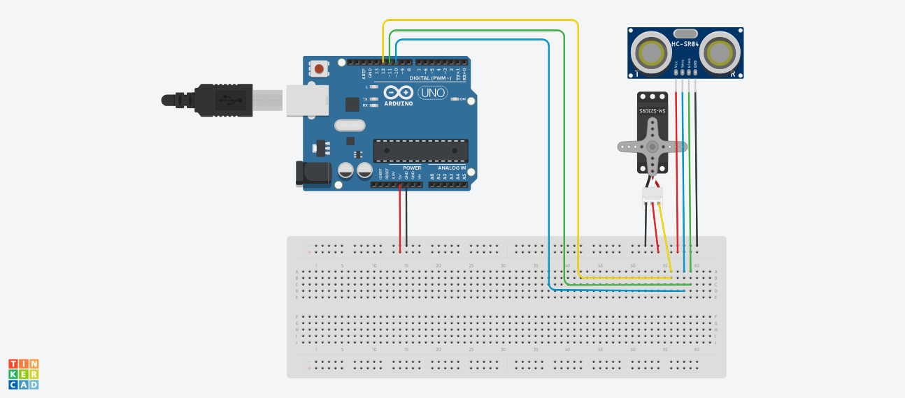

# IOT project

- Année : M2 IWOCS
- Matière: IOT

## Description
Réalisation d'un objet connecté capable de tranmettre des informations à une page ou app web
## Authors

| Nom             | Prénom                    | login    | email                                             |
| --------------- | ------------------------- | -------- | ------------------------------------------------- |
| ANDRIAMAHERISOA | Nomenjanahary Mahandrisoa | an194860 | nomenjanahary.andriamaherisoa@etu.univ-lehavre.fr |
| KEITA | Mohamed Alpha | km164357  | mohamed-alpha.keita@etu.univ-lehavre.fr |

##Objectif
Danc ce projet nous présentons comme créer un radar en utilisant une carte arduino rndu sur un visuel devéloppé en processing.

Pour la réalisation de l'objet, nous auront besoin:

- d'un capteur ultrasonic
- d'un petit servomoteur pour la rotation du capteur
- d'une boite arduino

## Les models utilisés

## Montage

Ce montage est réalisé en ligne sur tinderkard.com

Le modèle des composants utilisés sur le schéma de ce dessin n'est pas pareil sur notre objet connecté. En effet ce site ne propose pas tous les modèles. Il est possible de réaliser le dessin sur le logiciel fritzing qui dispose d'une plus grande bibliothèque de composants mais celui-ci est payant.

Nous connectons le capteur aux broches numéro 10 et 11 et le servomoteur à la broche numéro 12 sur la carte Arduino.

  

